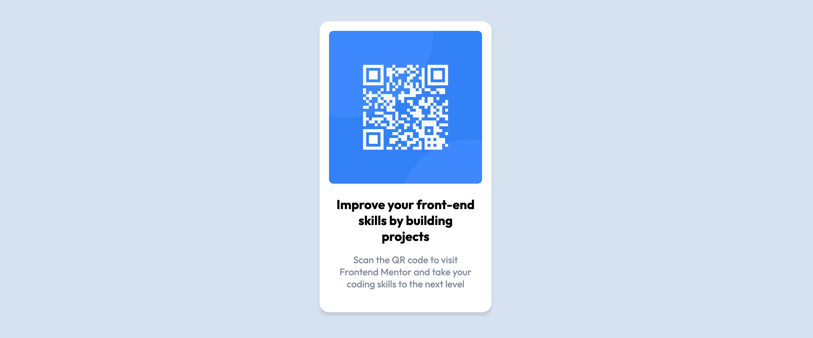

# QR-Code component

Hi everyone 🖐 !

This is my first project from Frontend Mentor. You can find the challenge [here](https://www.frontendmentor.io/challenges/qr-code-component-iux_sIO_H).

## What did I make this project 🤷‍♂️ ?

After having followed the amazing [Advanced CSS & Sass course](https://www.udemy.com/course/advanced-css-and-sass/) by Jonas Schmedtmann, I want to evolve and improve my front-end developer skills. I hope this is the beginning of a marathon 🤞 !

# Overview

## Screenshot

This is the design from Frontend Mentor :

Here's my solution :

You can visit the project's website following this link : https://musread.github.io/QrCode-Component/

## Used packages

- [Node Sass](https://www.npmjs.com/package/node-sass)
